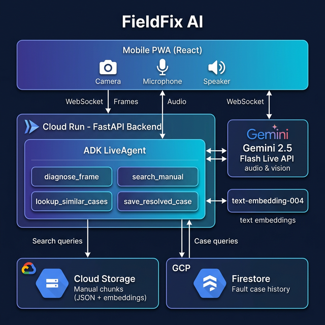

# FieldFix AI

> Real-time AI assistant for field technicians — grounded in your equipment manuals.

[](YOUR_DEMO_URL)
[](https://cloud.google.com)
[](https://ai.google.dev)

**Gemini Live Agent Challenge submission** — Track 1: Live Agent

## What it does

Field technicians point their phone camera at a broken device, describe the problem by voice, and receive live expert guidance — grounded in the actual equipment manual with section citations shown in real-time.

- 📷 **Camera + voice** → real-time Gemini Live API session
- 📖 **Every answer cited** from manual PDFs (RAG via Cloud Storage)
- 🧠 **Institutional memory**: learns from every resolved case (Firestore)
- 🎙️ **Interruptible**: technician can cut the agent off mid-sentence
- 🔧 **Step-by-step**: one repair action at a time, wait for confirmation

## Demo

[Watch the 4-minute demo video](YOUR_DEMO_VIDEO_URL)

## Architecture



### Tech Stack

| Layer | Technology |
|-------|-----------|
| AI | Gemini 2.5 Flash Live API + ADK |
| Backend | FastAPI + WebSocket on Cloud Run |
| Knowledge Base | PDF → Cloud Storage (embedded chunks) |
| Case History | Firestore |
| Frontend | React + TypeScript + Tailwind CSS (PWA) |
| Infrastructure | Terraform IaC |

## Quick start (local)

```bash
# Clone
git clone https://github.com/YOUR_USERNAME/fieldfix-ai
cd fieldfix-ai

# Backend
cd backend
cp .env.example .env  # fill in GCP_PROJECT_ID
pip install -r requirements.txt
uvicorn main:app --reload --port 8000

# Frontend (new terminal)
cd frontend
npm install
npm run dev
```

### Using Docker Compose (recommended)

```bash
docker compose up
# Backend: http://localhost:8000
# Frontend: http://localhost:5173
```

## Deploy to Google Cloud

```bash
# Set your project
export PROJECT_ID=your-gcp-project-id

# Authenticate
gcloud auth login
gcloud config set project $PROJECT_ID

# Enable APIs
gcloud services enable \
  run.googleapis.com \
  aiplatform.googleapis.com \
  firestore.googleapis.com \
  storage.googleapis.com \
  artifactregistry.googleapis.com

# Build and push
docker build -t us-central1-docker.pkg.dev/$PROJECT_ID/fieldfix/backend:latest backend/
docker push us-central1-docker.pkg.dev/$PROJECT_ID/fieldfix/backend:latest

# Deploy infrastructure
cd infra
cp terraform.tfvars.example terraform.tfvars
# Edit terraform.tfvars with your project ID
terraform init
terraform apply -var="project_id=$PROJECT_ID"

# Ingest a sample manual
cd ../backend
python -m tools.ingest_pdf \
  --pdf ../manuals/sample_solar_inverter.pdf \
  --industry solar \
  --model SMA-Sunny5000 \
  --source "SMA Inverter Manual"

# Seed demo data
python ../scripts/seed_firestore.py
```

## Project Structure

```
fieldfix-ai/
├── backend/           # FastAPI + ADK LiveAgent
│   ├── main.py        # WebSocket handler
│   ├── agent.py       # ADK agent definition
│   ├── tools/         # 4 agent tools
│   ├── core/          # Config, logging, GCP clients
│   ├── models/        # Pydantic models
│   └── tests/         # Pytest test suite
├── frontend/          # React + TypeScript + Tailwind
│   └── src/
│       ├── components/  # 6 UI components
│       ├── hooks/       # WebSocket, camera, microphone
│       └── store/       # Zustand state management
├── infra/             # Terraform IaC
├── scripts/           # Seed scripts
├── docs/              # Architecture diagram + demo script
├── docker-compose.yml # Local dev environment
├── cloudbuild.yaml    # CI/CD pipeline
├── BLOG_POST.md       # Challenge blog post
└── README.md
```

## Agent Tools

| Tool | Purpose |
|------|---------|
| `diagnose_frame` | Camera frame → Gemini Vision → structured fault diagnosis |
| `search_manual` | RAG search over equipment manual chunks (cosine similarity) |
| `lookup_similar_cases` | Query Firestore for previously resolved cases |
| `save_resolved_case` | Save resolved case to Firestore institutional memory |

## GDG Profile

[YOUR_GDG_PROFILE_URL]

## License

See [LICENSE](LICENSE) for details.
